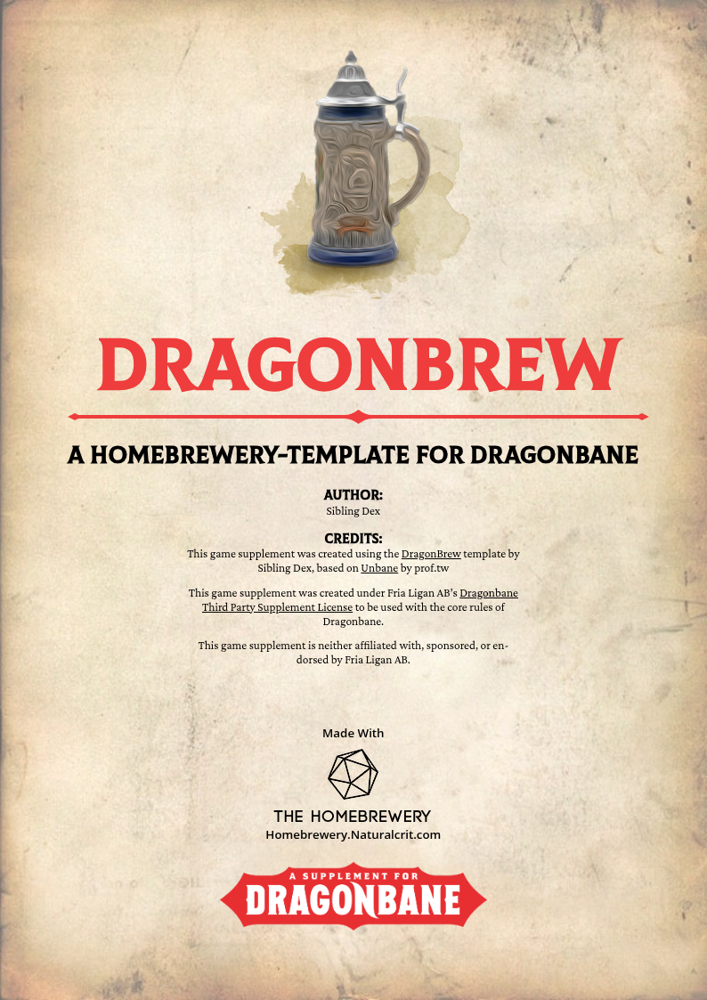
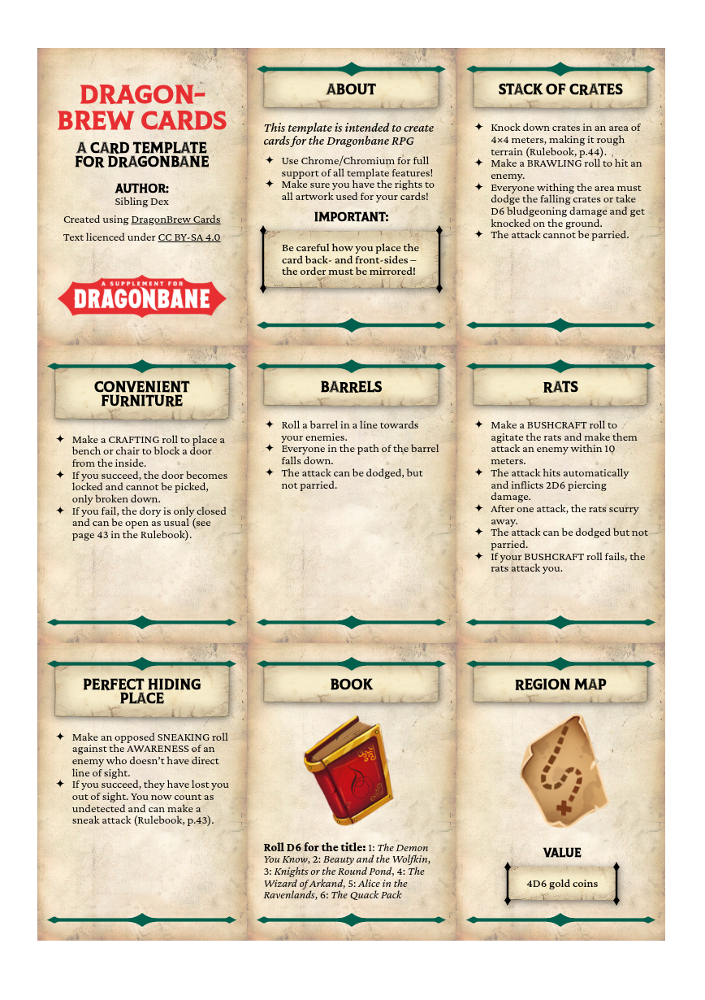
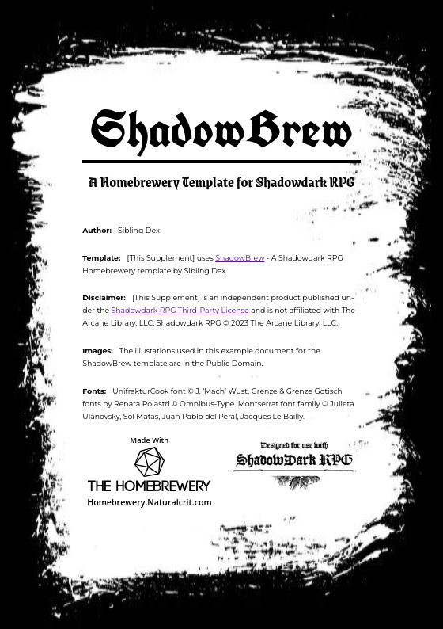
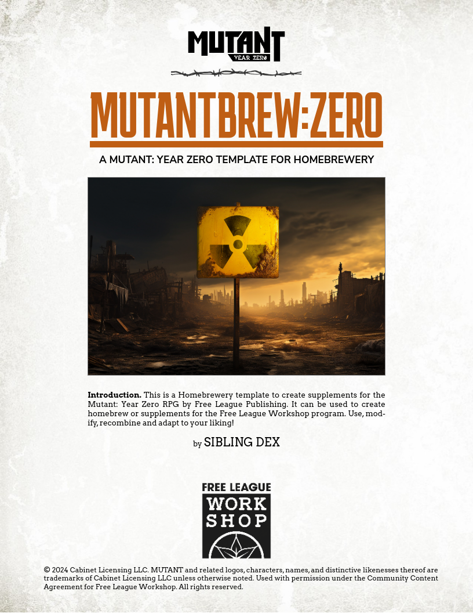
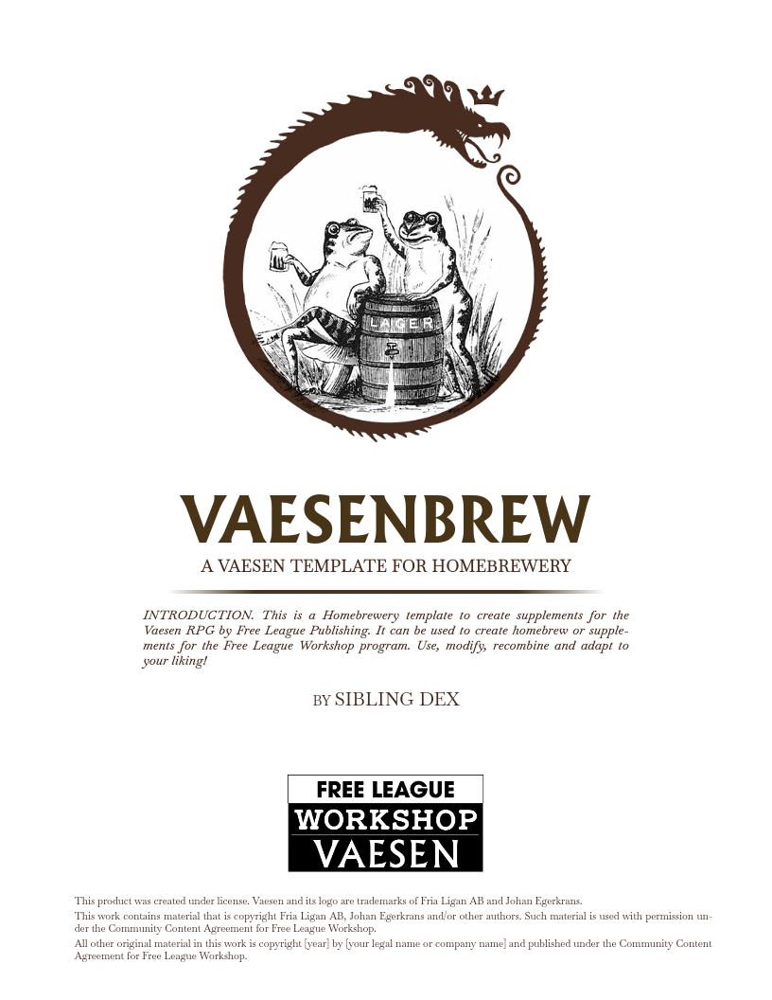

# Homebrewery Templates
> by Sibling Dex

Here is an overview of templates made by me for [The Hmebrewery](https://homebrewery.naturalcrit.com/):

## Dragonbrew

The [Dragonbrew](https://homebrewery.naturalcrit.com/share/IOEuWz2v8FFi) template was created by **Sibling Dex**, originally inspired by [Unbane](https://homebrewery.naturalcrit.com/share/giOlHPKwqVA-) by **prof.tw**. You can find both of us on the Dragonbane Discord. Message us there if you are interested in helping with this project.

## Dragonbrew Cards

The [Dragonbrew Cards](https://homebrewery.naturalcrit.com/share/Un91hvRXYK6I) template is intended to create cards for the Dragonbane RPG

## Shadowbrew

The [ShadowBrew](https://homebrewery.naturalcrit.com/share/UHqC503ByHK2) template is made for the ShadowDark RPG by Kelsey Dionne.

## Mutantbrew

The [Mutantbrew](https://homebrewery.naturalcrit.com/share/dEvi-4wqbW_2) template is made for the Mutant: Year Zero RPG by Free League.

## Vaesenbrew

The [Vaesenbrew](https://homebrewery.naturalcrit.com/share/yvJpv9TksyEb) template is made for the Vaesen RPG by Free League.

The [Codex Occultum - Missing Pages](https://homebrewery.naturalcrit.com/share/_066MShQBUk_) template is made to match the handout from the Vaesen RPG starter box.
